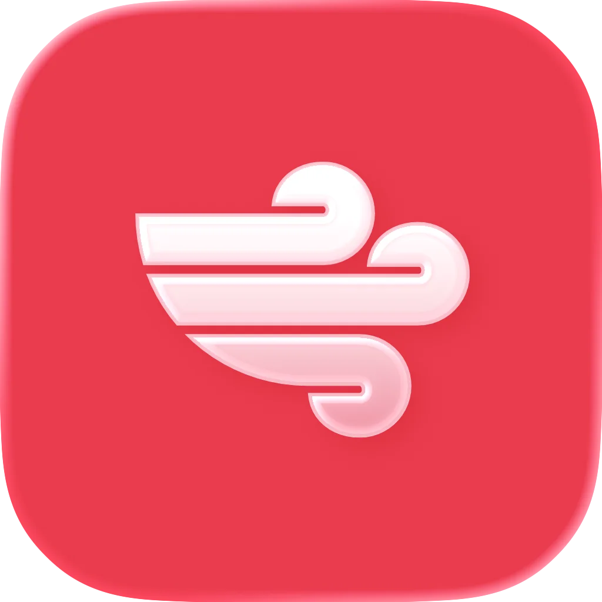

# DarkMusic

**Modern, ultra-fast music player with high-performance audio engine for Android & Windows.**

---

---

## 🚀 Download & Releases (v1.2.7)

| Platform | Package | Type | Size | Download Link |
| :--- | :--- | :--- | :--- | :--- |
| **Android** | `DarkMusic.apk` | Release APK (v1.2.7) | `33.9 MB` | [📥 Download APK](DarkMusic.apk?raw=true) |
| **Windows** | `DarkMusic-Installer.exe` | Setup Installer (x64) | `15.9 MB` | [📥 Download Installer](DarkMusic-Installer.exe?raw=true) |
| **Windows** | `DarkMusic.exe` | Portable Executable (x64) | `35.8 MB` | [📥 Download Portable](DarkMusic.exe?raw=true) |

---

## 🌟 Key Highlights

### 📱 Android Mobile App (v1.2.7)
- **High-Performance UI**: Tuned for ultra-smooth 60 FPS & 120 FPS high-refresh-rate displays with zero frame drops during heavy library scrolling.
- **Precomputed Metadata Engine**: Instant sorting, filtering, and searching over thousands of tracks without UI thread stutter.
- **Native Audio Engine**: Low-latency AAudio and FFmpeg playback pipeline supporting MP3, FLAC, AAC, WAV, OGG, and OPUS.
- **Synced Bilingual Lyrics**: Auto-scrolling lyrics with syllable/line-by-line sync, tap-to-seek, and bilingual translation display.
- **Desktop Sync via QR**: Pair wirelessly with DarkMusic Desktop to sync tracks, playlists, favorites, and play history in seconds.
- **Background & Lock Screen Controls**: Full media session notification with playback controls, seekbar, and artwork display.
- **Last.fm Scrobbling**: Built-in scrobbling directly from your device.

### 💻 Windows Desktop App (v1.2.7)
- **Fluid Glassmorphism Interface**: Sleek dark and OLED black surfaces powered by Wails v3 and hardware acceleration.
- **10-Band Native Equalizer**: High-precision miniaudio EQ engine with custom presets and headphone tuning.
- **Gapless & Crossfade Playback**: Transition seamlessly between tracks with customizable equal-power crossfade curves (1–12s).
- **Volume Normalization (LUFS)**: Automatic ITU-R BS.1770 / EBU R128 loudness analysis to prevent volume jumps between songs.
- **Smart Playlists & Mood Radio**: Automatic playlists generated from mood metrics, tempo, energy, and danceability.
- **Built-in Remote Server**: Control music playback, queue, and lyrics from any smartphone or browser on your local network.
- **System Tray & Mini Player**: Compact floating mini player and system tray controls for distraction-free listening.

---

## 📸 Screenshots

<b>Click to expand / collapse preview screenshots</b>

 

<table>
  <tr>
    <td width="33%">
<b>Home Overview</b>
</td>
    <td width="33%">
<b>Track Library</b>
</td>
    <td width="33%">
<b>Fullscreen Player & Lyrics</b>
</td>
  </tr>
  <tr>
    <td width="33%">
<b>Album Grid</b>
</td>
    <td width="33%">
<b>Artist Directory</b>
</td>
    <td width="33%">
<b>Playlists & Smart Mixes</b>
</td>
  </tr>
  <tr>
    <td width="33%">
<b>Desktop Mini Player</b>
</td>
    <td width="33%">
<b>Browser Remote Control</b>
</td>
    <td width="33%">
<b>Android Mobile App</b>
</td>
  </tr>
</table>

---

## 📦 Installation Guide

### Android Installation
1. Download **`DarkMusic.apk`**.
2. Tap the downloaded file in your browser or file manager.
3. If prompted by Android, enable **Allow from this source** for your browser/installer.
4. Tap **Install** and launch DarkMusic.
5. Grant audio and notification permissions when requested.

### Windows Installation
#### Method 1: Installer (Recommended)
1. Download **`DarkMusic-Installer.exe`**.
2. Run the installer and follow the setup wizard.
3. DarkMusic will create desktop and Start Menu shortcuts automatically.

#### Method 2: Portable
1. Download **`DarkMusic.exe`**.
2. Place it in any directory of your choice.
3. Double-click **`DarkMusic.exe`** to launch immediately without installation.

---

## 🛠️ Supported Formats & Codecs

| Category | Supported Formats |
| :--- | :--- |
| **Lossless** | FLAC, ALAC, WAV, AIFF, APE, DSD / DSF |
| **Lossy** | MP3, AAC, M4A, OGG Vorbis, Opus, WMA |
| **Playlists** | M3U, M3U8, PLS |
| **Lyrics** | Synchronized `.lrc`, Plain text `.txt`, Embedded ID3/Vorbis tags |

---

## 📄 License

DarkMusic is released under the **GNU General Public License v3.0 (GPL-3.0)**.
