<div align="center">

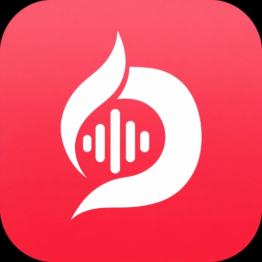

# DarkMusic

### *The Audiophile-Grade, Ultra-Responsive Music Player for Android & Windows*

[](https://github.com/shakti69/DarkMusic/releases/tag/v1.2.7)
[-3DDC84?style=for-the-badge&logo=android&logoColor=white)](DarkMusic.apk?raw=true)
[](DarkMusic-Installer.exe?raw=true)
[](https://github.com/shakti69/DarkMusic)
[](LICENSE)

<br/>

<p align="center">
  <b>DarkMusic</b> is a high-performance offline & local streaming music player engineered for listeners who care about sound quality, speed, and aesthetics. Built natively with <b>Jetpack Compose</b> for mobile and <b>Wails v3 + Go</b> for desktop, it delivers fluid 120 FPS navigation, real-time synchronized bilingual lyrics, bit-perfect playback, and effortless cross-device library pairing.
</p>

---

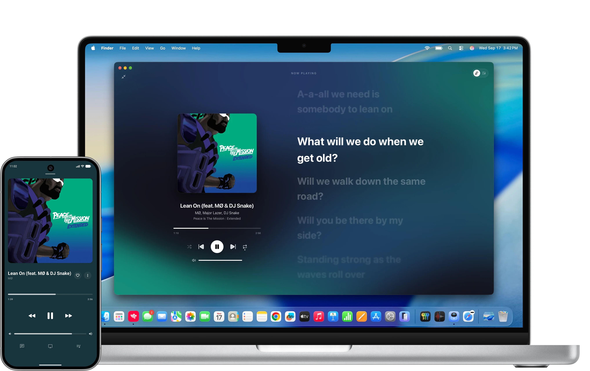

</div>

---

## 📥 Download Center (v1.2.7)

Choose the right build for your platform below. All releases are pre-compiled, self-contained, and ready to use.

| Platform | Distribution Package | Description | Binary Size | Download |
| :--- | :--- | :--- | :---: | :---: |
| 📱 **Android** | `DarkMusic.apk` | Release APK (Android 8.0 to Android 15)<br/>*Signed, R8-optimized, 120 FPS high-refresh engine* | **`33.7 MB`** | [**Download APK**](DarkMusic.apk?raw=true) |
| 🖥️ **Windows** | `DarkMusic-Installer.exe` | Windows Setup Installer (x64)<br/>*Auto-installs shortcuts, protocol handler & updater* | **`15.9 MB`** | [**Download Setup**](DarkMusic-Installer.exe?raw=true) |
| 🧳 **Windows** | `DarkMusic.exe` | Portable Executable (x64)<br/>*Zero installation required, run from USB or any folder* | **`35.8 MB`** | [**Download Portable**](DarkMusic.exe?raw=true) |

> 💡 **Release Tag**: You can also browse release notes and download assets directly from the [GitHub Releases page](https://github.com/shakti69/DarkMusic/releases/tag/v1.2.7).

---

## ✨ Features at a Glance

### ⚡ 1. Hyper-Optimized 120 FPS Engine
- **Zero-Allocation Scroll Pipeline**: Virtualized lists backed by precomputed metadata indices eliminate recomposition churn and GC pauses.
- **Instantaneous $O(1)$ Search & Sorting**: Filter through libraries with **50,000+ tracks** instantly by title, artist, album, duration, or date added.
- **Hardware-Accelerated Fluid UI**: Rendered with Jetpack Compose on Android and GPU-accelerated WebKit/Blink on Desktop for silky 60, 90, 120, and 144 Hz display support.

### 🎧 2. Bit-Perfect Audiophile Playback
- **Native Audio Pipeline**: Low-latency AAudio engine on Android and miniaudio on Windows with full 32-bit floating-point precision.
- **Gapless Transitions & Equal-Power Crossfade**: Switch tracks seamlessly with true gapless playback or configure smooth crossfades between 1 and 12 seconds.
- **Loudness Normalization (LUFS)**: Automatic ITU-R BS.1770 / EBU R128 loudness analysis (-14 LUFS target) with built-in anti-clipping limiter.
- **10-Band Native Equalizer**: Fine-tune your audio output across 10 discrete frequency bands with customizable headphone presets and preamp control.

### 📜 3. Synchronized Bilingual & Karaoke Lyrics
- **Multi-Tier Lyrics Matching**: Automatically fetches lyrics in priority order: Local `.lrc` / `.txt` files &rarr; Embedded ID3/Vorbis tags &rarr; LRCLIB &rarr; Kugou &rarr; NetEase.
- **Interactive Karaoke Display**: Follow syllable-level and line-by-line animations with automatic viewport scrolling.
- **Tap-to-Seek**: Jump directly to any moment in the song by tapping on a lyric line.
- **Bilingual Translation Support**: Read translations and Romanized phonetics side-by-side with original verses.

### 📲 4. Seamless Wireless Device Synchronization
- **One-Tap QR Pairing**: Connect your Android phone to your Windows PC over local Wi-Fi by scanning a single QR code.
- **Bi-Directional Library Sync**: Synchronize songs, high-resolution album artwork, custom playlists, favorites, and play counts without cloud servers or cords.
- **Local Privacy**: Your personal music collection stays 100% on your local hardware.

### 🌐 5. Local Web Remote Control
- **Browser-Based Controller**: Turn any smartphone, tablet, or secondary laptop into a wireless remote.
- **No Extra Apps Needed**: Open the generated local URL (with 4-digit PIN authentication) to control playback, manage queue, inspect tracks, and read lyrics from across the room.

### 📊 6. Listening Insights & Scrobbling
- **Last.fm Scrobbler**: Native scrobbling with persistent offline cache. Never miss a scrobble even when disconnected.
- **Detailed Insights Dashboard**: Visualize your listening history, top artists, most played tracks, and total listening time over 7-day, 30-day, or all-time periods.

---

## 📸 Interface Preview

<details open>
<summary><b>Click to expand or collapse high-resolution preview screenshots</b></summary>
<br/>

<table>
  <tr>
    <td width="33%">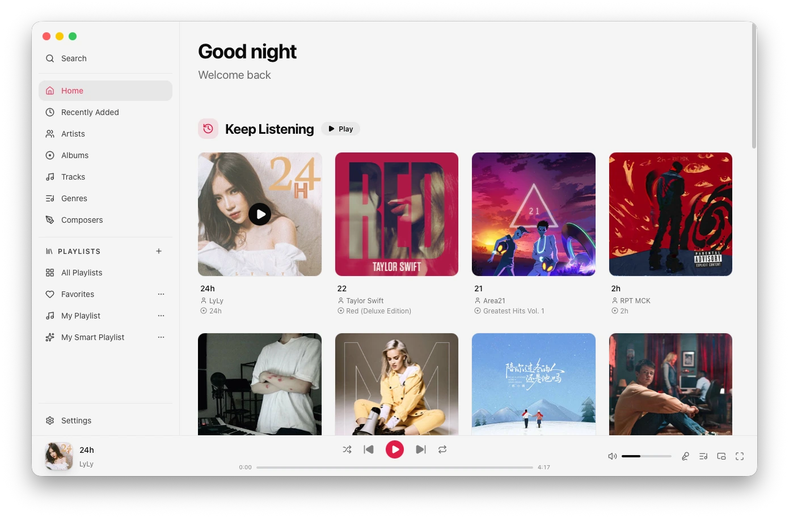<br/><p align="center"><b>Home Dashboard</b><br/><i>Quick mix, recent listens & smart picks</i></p></td>
    <td width="33%">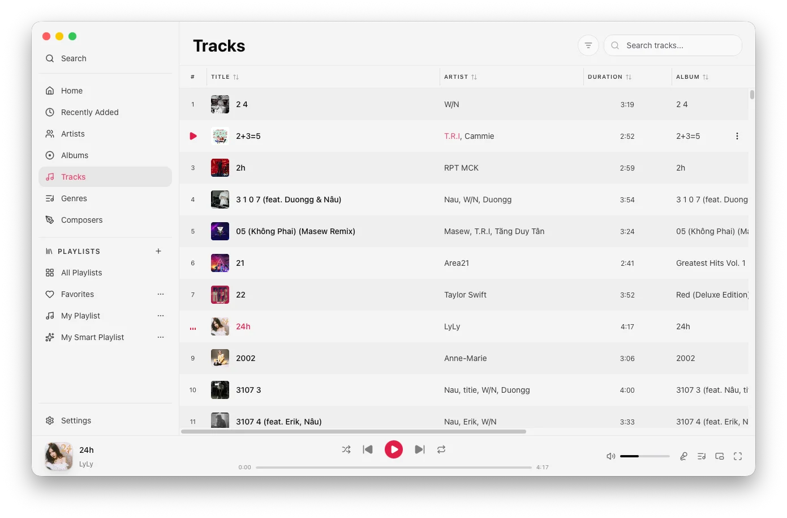<br/><p align="center"><b>Library Explorer</b><br/><i>Fast virtualization with instant sorting</i></p></td>
    <td width="33%">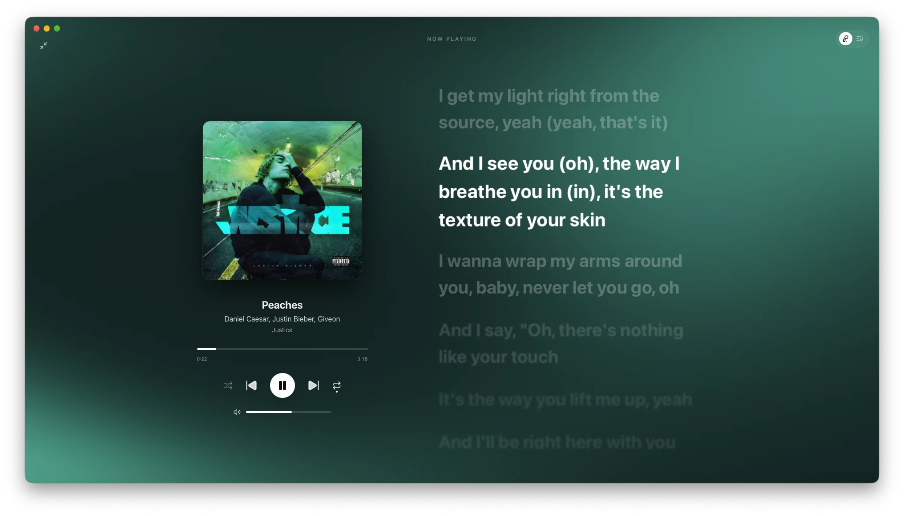<br/><p align="center"><b>Immersive Player</b><br/><i>Dynamic artwork & synchronized lyrics</i></p></td>
  </tr>
  <tr>
    <td width="33%">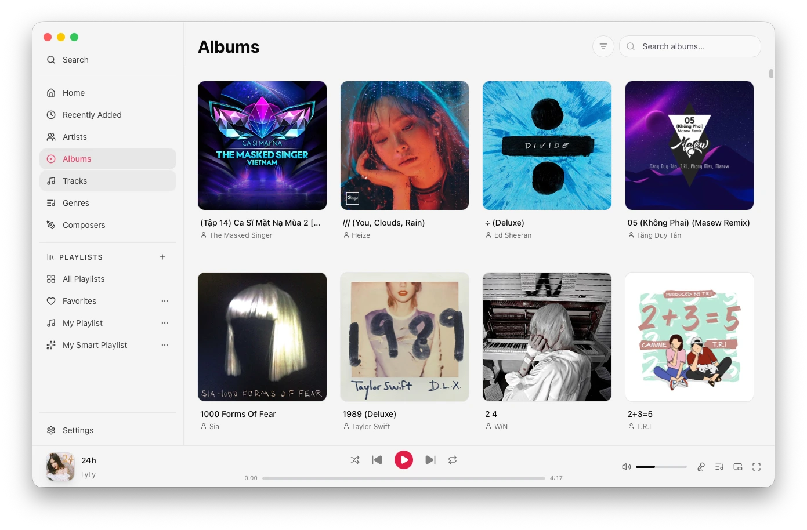<br/><p align="center"><b>Album Grid</b><br/><i>High-res cached artwork presentation</i></p></td>
    <td width="33%">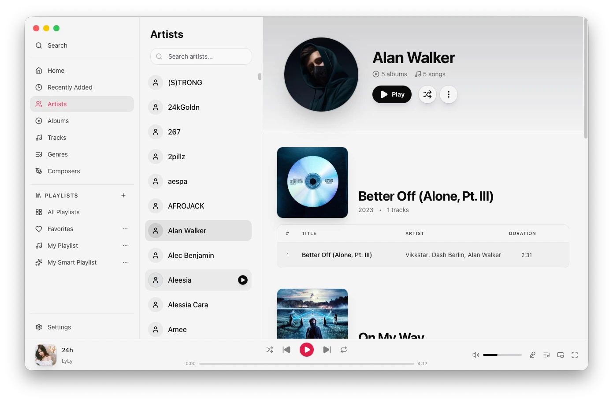<br/><p align="center"><b>Artist Directory</b><br/><i>Local artist portraits & discographies</i></p></td>
    <td width="33%">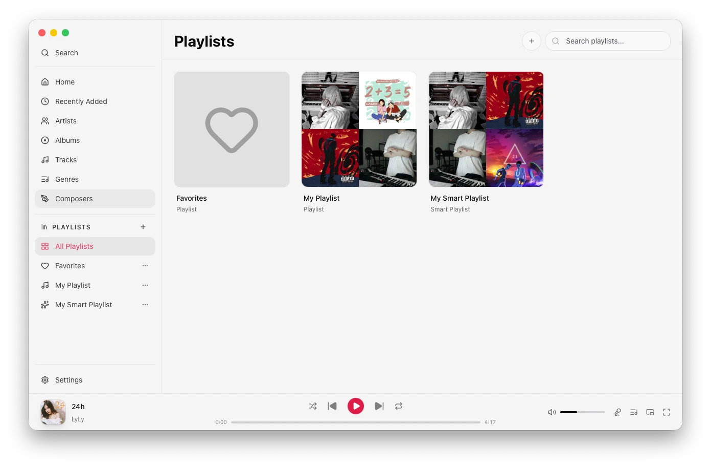<br/><p align="center"><b>Playlists & Moods</b><br/><i>Smart mixes based on energy & tempo</i></p></td>
  </tr>
  <tr>
    <td width="33%">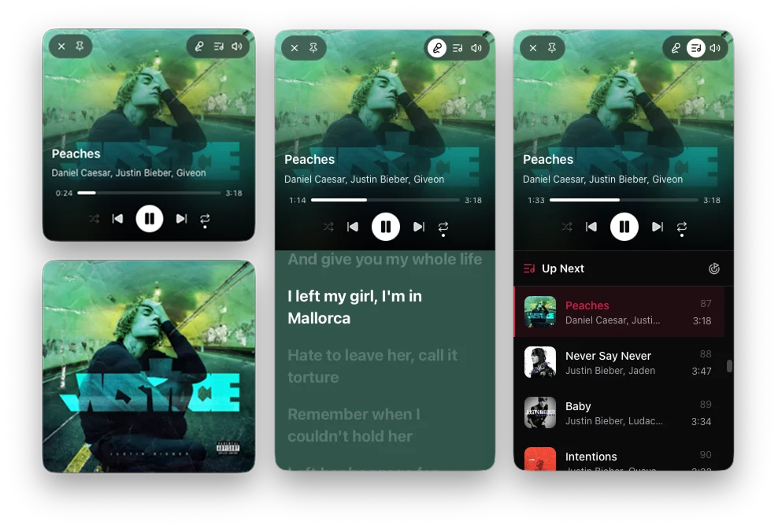<br/><p align="center"><b>Desktop Mini Player</b><br/><i>Floating always-on-top compact widget</i></p></td>
    <td width="33%">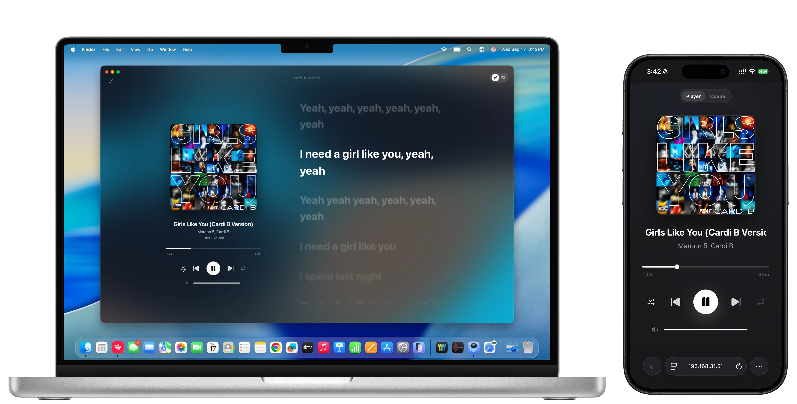<br/><p align="center"><b>Web Remote Controller</b><br/><i>Control playback from any browser</i></p></td>
    <td width="33%">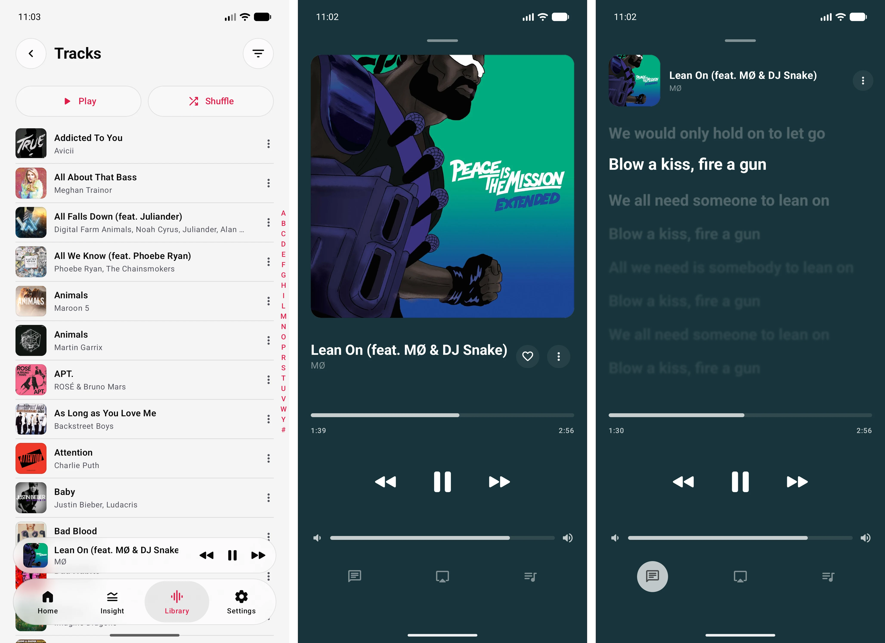<br/><p align="center"><b>Android Companion</b><br/><i>Native Material 3 Expressive UI</i></p></td>
  </tr>
</table>

</details>

---

## 🎼 Codec & Format Compatibility

DarkMusic processes all decoding through high-fidelity native libraries without transcoding or quality loss:

| Category | Supported Formats |
| :--- | :--- |
| **Lossless Hi-Res Audio** | **FLAC** (up to 32-bit/192kHz), **ALAC** (`.m4a`), **WAV** (PCM, IEEE Float), **AIFF**, **APE** (Monkey's Audio), **DSD / DSF** |
| **Lossy Compressed Audio** | **MP3** (CBR, VBR), **AAC** (`.aac`, `.m4a`), **OGG Vorbis**, **Opus**, **WMA** |
| **Playlists** | **M3U**, **M3U8** (UTF-8 extended), **PLS** |
| **Lyrics & Tags** | **LRC** (synchronized timestamps), **TXT** (plain text), **ID3v2**, **Vorbis Comments**, **APEv2** |

---

## 🛠️ Installation & Setup

### 📱 Android Setup Guide
1. **Download APK**: Download [`DarkMusic.apk`](DarkMusic.apk?raw=true).
2. **Install**: Tap the downloaded file. If your browser asks for permission to install apps from this source, enable **Allow from this source**.
3. **Grant Permissions**:
   - **Audio / Media**: Allows DarkMusic to locate and play your local music files.
   - **Notifications**: Enables persistent lock-screen playback controls and background service.
4. *(Optional Recommendation)*: Exclude DarkMusic from aggressive system battery optimization for uninterrupted background playback.

---

### 💻 Windows Setup Guide

#### Option A: Full Installer (`DarkMusic-Installer.exe`) — *Recommended*
- Double-click the installer and follow on-screen instructions.
- Automatically associates media files, registers the `darkmusic://` deep-link protocol, and creates Desktop / Start Menu shortcuts.

#### Option B: Standalone Portable (`DarkMusic.exe`)
- Download the single executable and place it anywhere (e.g. `C:\Tools\DarkMusic` or a USB drive).
- Run directly without installation or administrator privileges. All user settings are saved locally.

---

## ⌨️ Desktop Keyboard Shortcuts

| Shortcut | Action |
| :--- | :--- |
| <kbd>Space</kbd> | Toggle Play / Pause |
| <kbd>&larr;</kbd> / <kbd>&rarr;</kbd> | Seek Backward / Forward 5 seconds |
| <kbd>&uarr;</kbd> / <kbd>&darr;</kbd> | Volume Up / Volume Down |
| <kbd>Ctrl</kbd> + <kbd>&larr;</kbd> | Previous Track |
| <kbd>Ctrl</kbd> + <kbd>&rarr;</kbd> | Next Track |
| <kbd>Ctrl</kbd> + <kbd>F</kbd> | Focus Search Bar |
| <kbd>Ctrl</kbd> + <kbd>M</kbd> | Toggle Floating Mini Player |
| <kbd>F11</kbd> | Toggle Fullscreen Immersive Lyrics Mode |
| <kbd>Esc</kbd> | Close Overlay / Exit Fullscreen |

---

## 🏗️ Technical Architecture

```
                          ┌──────────────────────────┐
                          │   DarkMusic Ecosystem    │
                          └─────────────┬────────────┘
                                        │
             ┌──────────────────────────┴──────────────────────────┐
             │                                                     │
             ▼                                                     ▼
┌───────────────────────────┐                         ┌───────────────────────────┐
│     Android Application   │                         │     Windows Application   │
├───────────────────────────┤                         ├───────────────────────────┤
│ • UI: Jetpack Compose     │                         │ • Frontend: Vue 3 + Vite  │
│ • Runtime: Kotlin Multi   │ ◄───[ Wireless QR ]───► │ • Framework: Wails v3     │
│ • Database: Room SQLite   │      Sync Protocol      │ • Backend: Go 1.25        │
│ • Audio: AAudio + C++ JNI │                         │ • Audio: miniaudio (CGO)  │
│ • Decoder: FFmpeg 7.x     │                         │ • Remote: WebSockets + Go │
└───────────────────────────┘                         └───────────────────────────┘
```

---

## 🛡️ License & Acknowledgments

- **License**: DarkMusic is free and open-source software licensed under the **[GNU General Public License v3.0 (GPL-3.0)](LICENSE)**.
- **Audio Engines**: Powered by [FFmpeg](https://ffmpeg.org/), [AAudio](https://developer.android.com/ndk/guides/audio/aaudio/aaudio), and [miniaudio](https://miniaud.io/).
- **Online Lyrics**: Lyrics integration provided via [LRCLIB](https://lrclib.net/), Kugou, and NetEase APIs.
- **Scrobbling**: Powered by the [Last.fm](https://www.last.fm/) open API.

---

<div align="center">
  <sub>Crafted with passion for pure sound. If you enjoy DarkMusic, consider starring ⭐ the repository!</sub>
</div>
